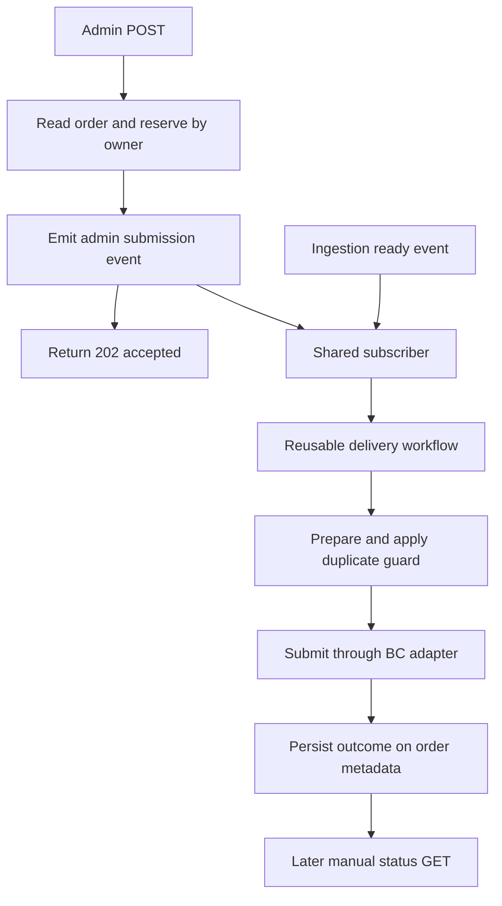

# Business Central order submission

**Last updated:** 2026-10-05
**Related work:** NIMBUS-158

## Overview

The backend submits persisted Medusa orders to Business Central through one reusable delivery workflow. Order ingestion starts automatic delivery; authenticated Admin users can inspect the current outcome, start an ordinary retry or explicitly force another delivery. The Admin widget reports accepted starts separately from completed delivery and reloads the outcome only on manual Refresh.

## Components

Paths below are relative to `apps/backend/src/`.

| Component | Responsibility |
|-----------|----------------|
| `modules/order-ingestion/bc-integration-state.ts` | Persisted metadata contract, parsing and shared existing-BC-order predicate |
| `workflows/business-central-order/workflows/send-order-to-business-central.ts` | Existing preparation, vendor submission and outcome recording workflow |
| `workflows/business-central-order/workflows/request-bc-submission.ts` | Short Admin acceptance workflow: read order, reserve its submission and emit an event |
| `subscribers/business-central-order-ready.ts` | Starts the same delivery workflow for automatic and Admin events; maintains the shared reservation |
| `api/admin/orders/[id]/bc-integration/` | Authenticated status projection and validated submission endpoint |
| `admin/widgets/bc-order-status.tsx`, `admin/hooks/api/bc-integration.tsx` | Order-detail side widget and session SDK queries/mutation |

Delivery uses the existing Business Central module adapter, canonical order metadata and resolved company/customer context. An accepted start can later produce a failed outcome if the required delivery context is missing. There are no additional tables or migrations for Admin status/retry.

## State and HTTP contract

The current state lives at `Order.metadata.business_central_integration`. Persisted statuses are `pending`, `sent` and `failed`; `pending` never indicates that a submission is currently running. An untracked Admin response has null status and a zero attempt count.

Both endpoints use Medusa's default Admin user authentication. All authenticated Admin users have access; there is no separate role restriction. Anonymous, invalid bearer and customer bearer requests are denied. The widget uses the existing session SDK client.

| Endpoint | Behavior |
|----------|----------|
| `GET /admin/orders/:id/bc-integration` | Core order-detail workflow read; returns `{ bc_integration }`, or 404 for a missing order |
| `POST /admin/orders/:id/bc-integration/submit` | Strict `{ force_resend?: boolean }`, default false; returns 202 after reservation/event acceptance, 409 for active overlap, 400 for invalid/extra fields and 404 for a missing order |

The status DTO exposes only `status`, `bc_order_id`, `bc_order_number`, `attempt_count`, `initialized_at`, `last_attempt_at`, `sent_at`, `partial`, known `failure_reason` codes and `line_failures` containing `line_number`/known `reason`. Unknown free-text failure reasons become null. Raw canonical payloads, line identifiers, vendor messages and exception details are excluded. Widget request failures use fixed local feedback rather than displaying backend error text.

## Submission flow

The subscriber handles `order_ingestion.ready_for_business_central` and `order_ingestion.admin_bc_submission_requested`. Both paths share `bc-submission-<orderId>` reservations and the deterministic `getSendOrderToBusinessCentralTransactionId(orderId)`. The delivery workflow retains `store: true`; overlapping active runs are also guarded by the configured workflow engine, while completed attempts can be retried.

An Admin acceptance reservation is acquired in a workflow step, never in the route. Failed event emission compensates it. During delivery, the subscriber renews the same owner every 1200 seconds for a 3600-second lease, because vendor lookups can outlast the initial lease. Cleanup stops the timer, awaits pending renewal and releases only that owner. A 202 response means the start was reserved/emitted; it does not promise successful BC completion.

## Duplicate protection and Admin interaction

`hasBusinessCentralOrder` is the shared rule: sent status or a recorded BC ID means an existing BC order. `shouldSkipBcSubmission` preserves this guard for ordinary requests; only explicit `force_resend: true` bypasses it. An ordinary request for an existing BC order can return 202 and finish without another vendor write.

The widget uses the same predicate to open a duplicate-order warning, shows the current identifier when present, and submits true only after confirmation. Cancel sends no request. A forced attempt that fails before receiving a new BC identifier retains the previous identifier/number so later ordinary requests remain duplicate-safe. Only the current recorded identity is shown; previous force-created orders are not a history feature.

Status loads on mount. Subsequent reads require Refresh: mutation invalidation, focus/reconnect refresh and polling are disabled. Submission requires a successful status read and is disabled during status fetching or mutation. Feedback after 202 asks the operator to Refresh rather than claiming delivery succeeded.

## Runtime constraints and extension points

The current configuration relies on local event dispatch and in-memory locking; no Redis-backed coordination is configured. Shared reservations protect one configured runtime. Cross-instance coordination, restart survival of accepted work and deployed workflow-engine guarantees have not been verified; `store: true` alone is not a durability claim. There is no scheduled recovery job, retry schedule or automatic widget refresh.

Keep the existing duplicate predicate and explicit force policy as single rule homes. New submission callers must preserve the shared reservation and deterministic workflow transaction ID. Extend status through the sanitized projection rather than exposing raw metadata, and keep vendor mapping/submission in the existing delivery workflow. Durable dispatch or distributed coordination requires a separate infrastructure decision and runtime verification.

## Verification

Unit and Admin tests cover the shared guard, nullable status, manual Refresh, confirmation/cancellation and sanitized failures. Real HTTP/PostgreSQL tests exercise default authentication, exact DTO/request contracts, deferred asynchronous acceptance, normal/forced delivery, automatic/Admin overlap, event compensation, owner isolation and lease renewal/cleanup beyond the original TTL. Vendor HTTP responses in these tests are synthetic.

After deployment, use a designated order in the approved BC test environment. Check Admin access and 401 denials, 202 before completion and 409 during overlap; compare the later persisted BC identifier/number with the actual BC sales order. Check manual Refresh and cancellation in the deployed widget, ordinary duplicate safety, and an explicitly confirmed force resend. Live BC delivery, deployed widget placement and cross-instance behavior remain unverified until these checks run.
